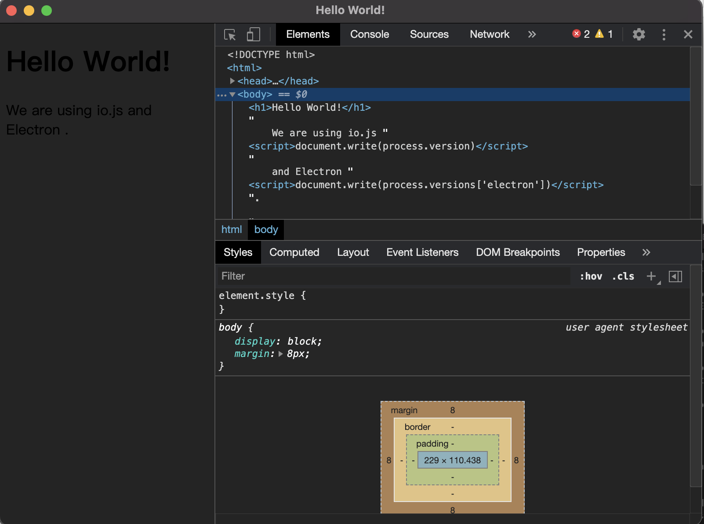
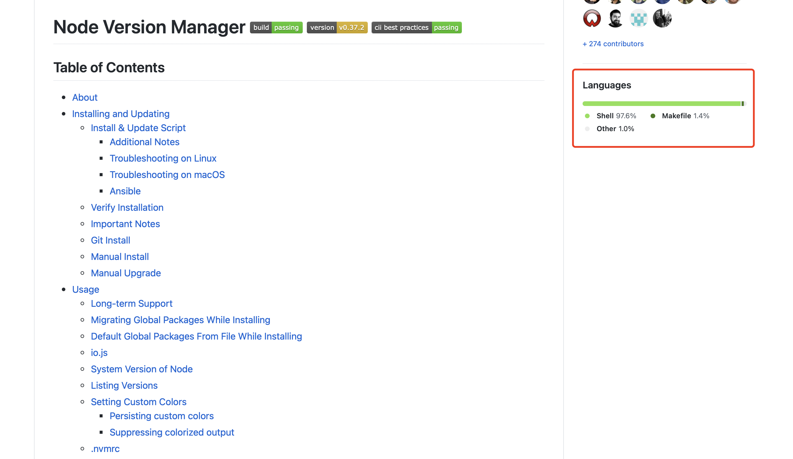

## 入门过程

### 1、找台电脑
    mac、windows、ubuntu机子，因为mac比较爽，所以选择了Mac，都差不多的。

### 2、构思下

### 3、开始编写
http://www.electronjs.org
<br/>
[Electron 快速入门](https://www.w3cschool.cn/electronmanual/p9al1qkx.html)
<br/>
[极客时间/geektime-electron](https://gitee.com/geektime-geekbang/geektime-electron)  


&ensp;&ensp;拿到上面的demo抄起来，快速借鉴下。

<br/>
<br/>

<br/>

### 4、体验

&ensp;&ensp; 最明显看到的效果就是，可以编写出桌面程序，特别是有前端背景的技术人员。那这有什么用？肉眼可见的天赋，就是JavaScript技术栈的人又往全栈能力提升了。
<br/>

&ensp;&ensp; JavaScript技术栈可以做什么事呢？
+ 前端：浏览器H5（MacOS、Windows、Linux、Android等平台的浏览器内核，主要是chromium），欣欣向荣的前端拥有着数不清的库与框架。主要是和浏览器打交道。
+ 客户端：React Native（Android、IOS等APP通过JSBridge调用原生API）、Electron(MacOS、Windows、Linux等平台的桌面程序)，都是与各个平台的各种App程序打交道，比上面前端一个浏览器App打天下，又扩张了应用领域。
+ 服务端：基于Node.js运行时实现的接口服务功能（RESTful API框架）

### 5、进一步分析
#### 5.1、**为什么要安装nvm**
  &ensp;&ensp; 首先我们来了解下nvm是什么？

        Node Version Manager - POSIX-compliant bash script to manage multiple active node.js versions

<br/>
<br/>


&ensp;&ensp; 我们看了nvm源码就是用shell脚本语言编写的，是个node版本管理器，管理node.js版本的。具体的安装过程就是执行了nvm仓库中的install.sh脚本，具体的脚本如下：

```bash
#!/usr/bin/env bash

{ # this ensures the entire script is downloaded #

nvm_has() {
  type "$1" > /dev/null 2>&1
}

nvm_grep() {
  GREP_OPTIONS='' command grep "$@"
}

nvm_default_install_dir() {
  [ -z "${XDG_CONFIG_HOME-}" ] && printf %s "${HOME}/.nvm" || printf %s "${XDG_CONFIG_HOME}/nvm"
}

nvm_install_dir() {
  if [ -n "$NVM_DIR" ]; then
    printf %s "${NVM_DIR}"
  else
    nvm_default_install_dir
  fi
}

nvm_latest_version() {
  echo "v0.37.2"
}

nvm_profile_is_bash_or_zsh() {
  local TEST_PROFILE
  TEST_PROFILE="${1-}"
  case "${TEST_PROFILE-}" in
    *"/.bashrc" | *"/.bash_profile" | *"/.zshrc")
      return
    ;;
    *)
      return 1
    ;;
  esac
}

#
# Outputs the location to NVM depending on:
# * The availability of $NVM_SOURCE
# * The method used ("script" or "git" in the script, defaults to "git")
# NVM_SOURCE always takes precedence unless the method is "script-nvm-exec"
#
nvm_source() {
  local NVM_GITHUB_REPO
  NVM_GITHUB_REPO="${NVM_INSTALL_GITHUB_REPO:-nvm-sh/nvm}"
  local NVM_VERSION
  NVM_VERSION="${NVM_INSTALL_VERSION:-$(nvm_latest_version)}"
  local NVM_METHOD
  NVM_METHOD="$1"
  local NVM_SOURCE_URL
  NVM_SOURCE_URL="$NVM_SOURCE"
  if [ "_$NVM_METHOD" = "_script-nvm-exec" ]; then
    NVM_SOURCE_URL="https://raw.githubusercontent.com/${NVM_GITHUB_REPO}/${NVM_VERSION}/nvm-exec"
  elif [ "_$NVM_METHOD" = "_script-nvm-bash-completion" ]; then
    NVM_SOURCE_URL="https://raw.githubusercontent.com/${NVM_GITHUB_REPO}/${NVM_VERSION}/bash_completion"
  elif [ -z "$NVM_SOURCE_URL" ]; then
    if [ "_$NVM_METHOD" = "_script" ]; then
      NVM_SOURCE_URL="https://raw.githubusercontent.com/${NVM_GITHUB_REPO}/${NVM_VERSION}/nvm.sh"
    elif [ "_$NVM_METHOD" = "_git" ] || [ -z "$NVM_METHOD" ]; then
      NVM_SOURCE_URL="https://github.com/${NVM_GITHUB_REPO}.git"
    else
      echo >&2 "Unexpected value \"$NVM_METHOD\" for \$NVM_METHOD"
      return 1
    fi
  fi
  echo "$NVM_SOURCE_URL"
}

#
# Node.js version to install
#
nvm_node_version() {
  echo "$NODE_VERSION"
}

nvm_download() {
  if nvm_has "curl"; then
    curl --fail --compressed -q "$@"
  elif nvm_has "wget"; then
    # Emulate curl with wget
    ARGS=$(nvm_echo "$@" | command sed -e 's/--progress-bar /--progress=bar /' \
                            -e 's/--compressed //' \
                            -e 's/--fail //' \
                            -e 's/-L //' \
                            -e 's/-I /--server-response /' \
                            -e 's/-s /-q /' \
                            -e 's/-sS /-nv /' \
                            -e 's/-o /-O /' \
                            -e 's/-C - /-c /')
    # shellcheck disable=SC2086
    eval wget $ARGS
  fi
}

install_nvm_from_git() {
  local INSTALL_DIR
  INSTALL_DIR="$(nvm_install_dir)"
  local NVM_VERSION
  NVM_VERSION="${NVM_INSTALL_VERSION:-$(nvm_latest_version)}"
  if [ -n "${NVM_INSTALL_VERSION:-}" ]; then
    # Check if version is an existing ref
    if command git ls-remote "$(nvm_source "git")" "$NVM_VERSION" | nvm_grep -q "$NVM_VERSION" ; then
      :
    # Check if version is an existing changeset
    elif ! nvm_download -o /dev/null "$(nvm_source "script-nvm-exec")"; then
      echo >&2 "Failed to find '$NVM_VERSION' version."
      exit 1
    fi
  fi

  local fetch_error
  if [ -d "$INSTALL_DIR/.git" ]; then
    # Updating repo
    echo "=> nvm is already installed in $INSTALL_DIR, trying to update using git"
    command printf '\r=> '
    fetch_error="Failed to update nvm with $NVM_VERSION, run 'git fetch' in $INSTALL_DIR yourself."
  else
    fetch_error="Failed to fetch origin with $NVM_VERSION. Please report this!"
    echo "=> Downloading nvm from git to '$INSTALL_DIR'"
    command printf '\r=> '
    mkdir -p "${INSTALL_DIR}"
    if [ "$(ls -A "${INSTALL_DIR}")" ]; then
      # Initializing repo
      command git init "${INSTALL_DIR}" || {
        echo >&2 'Failed to initialize nvm repo. Please report this!'
        exit 2
      }
      command git --git-dir="${INSTALL_DIR}/.git" remote add origin "$(nvm_source)" 2> /dev/null \
        || command git --git-dir="${INSTALL_DIR}/.git" remote set-url origin "$(nvm_source)" || {
        echo >&2 'Failed to add remote "origin" (or set the URL). Please report this!'
        exit 2
      }
    else
      # Cloning repo
      command git clone "$(nvm_source)" --depth=1 "${INSTALL_DIR}" || {
        echo >&2 'Failed to clone nvm repo. Please report this!'
        exit 2
      }
    fi
  fi
  # Try to fetch tag
  if command git --git-dir="$INSTALL_DIR"/.git --work-tree="$INSTALL_DIR" fetch origin tag "$NVM_VERSION" --depth=1 2>/dev/null; then
    :
  # Fetch given version
  elif ! command git --git-dir="$INSTALL_DIR"/.git --work-tree="$INSTALL_DIR" fetch origin "$NVM_VERSION" --depth=1; then
    echo >&2 "$fetch_error"
    exit 1
  fi
  command git -c advice.detachedHead=false --git-dir="$INSTALL_DIR"/.git --work-tree="$INSTALL_DIR" checkout -f --quiet FETCH_HEAD || {
    echo >&2 "Failed to checkout the given version $NVM_VERSION. Please report this!"
    exit 2
  }
  if [ -n "$(command git --git-dir="$INSTALL_DIR"/.git --work-tree="$INSTALL_DIR" show-ref refs/heads/master)" ]; then
    if command git --git-dir="$INSTALL_DIR"/.git --work-tree="$INSTALL_DIR" branch --quiet 2>/dev/null; then
      command git --git-dir="$INSTALL_DIR"/.git --work-tree="$INSTALL_DIR" branch --quiet -D master >/dev/null 2>&1
    else
      echo >&2 "Your version of git is out of date. Please update it!"
      command git --git-dir="$INSTALL_DIR"/.git --work-tree="$INSTALL_DIR" branch -D master >/dev/null 2>&1
    fi
  fi

  echo "=> Compressing and cleaning up git repository"
  if ! command git --git-dir="$INSTALL_DIR"/.git --work-tree="$INSTALL_DIR" reflog expire --expire=now --all; then
    echo >&2 "Your version of git is out of date. Please update it!"
  fi
  if ! command git --git-dir="$INSTALL_DIR"/.git --work-tree="$INSTALL_DIR" gc --auto --aggressive --prune=now ; then
    echo >&2 "Your version of git is out of date. Please update it!"
  fi
  return
}

#
# Automatically install Node.js
#
nvm_install_node() {
  local NODE_VERSION_LOCAL
  NODE_VERSION_LOCAL="$(nvm_node_version)"

  if [ -z "$NODE_VERSION_LOCAL" ]; then
    return 0
  fi

  echo "=> Installing Node.js version $NODE_VERSION_LOCAL"
  nvm install "$NODE_VERSION_LOCAL"
  local CURRENT_NVM_NODE

  CURRENT_NVM_NODE="$(nvm_version current)"
  if [ "$(nvm_version "$NODE_VERSION_LOCAL")" == "$CURRENT_NVM_NODE" ]; then
    echo "=> Node.js version $NODE_VERSION_LOCAL has been successfully installed"
  else
    echo >&2 "Failed to install Node.js $NODE_VERSION_LOCAL"
  fi
}

install_nvm_as_script() {
  local INSTALL_DIR
  INSTALL_DIR="$(nvm_install_dir)"
  local NVM_SOURCE_LOCAL
  NVM_SOURCE_LOCAL="$(nvm_source script)"
  local NVM_EXEC_SOURCE
  NVM_EXEC_SOURCE="$(nvm_source script-nvm-exec)"
  local NVM_BASH_COMPLETION_SOURCE
  NVM_BASH_COMPLETION_SOURCE="$(nvm_source script-nvm-bash-completion)"

  # Downloading to $INSTALL_DIR
  mkdir -p "$INSTALL_DIR"
  if [ -f "$INSTALL_DIR/nvm.sh" ]; then
    echo "=> nvm is already installed in $INSTALL_DIR, trying to update the script"
  else
    echo "=> Downloading nvm as script to '$INSTALL_DIR'"
  fi
  nvm_download -s "$NVM_SOURCE_LOCAL" -o "$INSTALL_DIR/nvm.sh" || {
    echo >&2 "Failed to download '$NVM_SOURCE_LOCAL'"
    return 1
  } &
  nvm_download -s "$NVM_EXEC_SOURCE" -o "$INSTALL_DIR/nvm-exec" || {
    echo >&2 "Failed to download '$NVM_EXEC_SOURCE'"
    return 2
  } &
  nvm_download -s "$NVM_BASH_COMPLETION_SOURCE" -o "$INSTALL_DIR/bash_completion" || {
    echo >&2 "Failed to download '$NVM_BASH_COMPLETION_SOURCE'"
    return 2
  } &
  for job in $(jobs -p | command sort)
  do
    wait "$job" || return $?
  done
  chmod a+x "$INSTALL_DIR/nvm-exec" || {
    echo >&2 "Failed to mark '$INSTALL_DIR/nvm-exec' as executable"
    return 3
  }
}

nvm_try_profile() {
  if [ -z "${1-}" ] || [ ! -f "${1}" ]; then
    return 1
  fi
  echo "${1}"
}

#
# Detect profile file if not specified as environment variable
# (eg: PROFILE=~/.myprofile)
# The echo'ed path is guaranteed to be an existing file
# Otherwise, an empty string is returned
#
nvm_detect_profile() {
  if [ "${PROFILE-}" = '/dev/null' ]; then
    # the user has specifically requested NOT to have nvm touch their profile
    return
  fi

  if [ -n "${PROFILE}" ] && [ -f "${PROFILE}" ]; then
    echo "${PROFILE}"
    return
  fi

  local DETECTED_PROFILE
  DETECTED_PROFILE=''

  if [ -n "${BASH_VERSION-}" ]; then
    if [ -f "$HOME/.bashrc" ]; then
      DETECTED_PROFILE="$HOME/.bashrc"
    elif [ -f "$HOME/.bash_profile" ]; then
      DETECTED_PROFILE="$HOME/.bash_profile"
    fi
  elif [ -n "${ZSH_VERSION-}" ]; then
    DETECTED_PROFILE="$HOME/.zshrc"
  fi

  if [ -z "$DETECTED_PROFILE" ]; then
    for EACH_PROFILE in ".profile" ".bashrc" ".bash_profile" ".zshrc"
    do
      if DETECTED_PROFILE="$(nvm_try_profile "${HOME}/${EACH_PROFILE}")"; then
        break
      fi
    done
  fi

  if [ -n "$DETECTED_PROFILE" ]; then
    echo "$DETECTED_PROFILE"
  fi
}

#
# Check whether the user has any globally-installed npm modules in their system
# Node, and warn them if so.
#
nvm_check_global_modules() {
  local NPM_COMMAND
  NPM_COMMAND="$(command -v npm 2>/dev/null)" || return 0
  [ -n "${NVM_DIR}" ] && [ -z "${NPM_COMMAND%%$NVM_DIR/*}" ] && return 0

  local NPM_VERSION
  NPM_VERSION="$(npm --version)"
  NPM_VERSION="${NPM_VERSION:--1}"
  [ "${NPM_VERSION%%[!-0-9]*}" -gt 0 ] || return 0

  local NPM_GLOBAL_MODULES
  NPM_GLOBAL_MODULES="$(
    npm list -g --depth=0 |
    command sed -e '/ npm@/d' -e '/ (empty)$/d'
  )"

  local MODULE_COUNT
  MODULE_COUNT="$(
    command printf %s\\n "$NPM_GLOBAL_MODULES" |
    command sed -ne '1!p' |                     # Remove the first line
    wc -l | command tr -d ' '                   # Count entries
  )"

  if [ "${MODULE_COUNT}" != '0' ]; then
    # shellcheck disable=SC2016
    echo '=> You currently have modules installed globally with `npm`. These will no'
    # shellcheck disable=SC2016
    echo '=> longer be linked to the active version of Node when you install a new node'
    # shellcheck disable=SC2016
    echo '=> with `nvm`; and they may (depending on how you construct your `$PATH`)'
    # shellcheck disable=SC2016
    echo '=> override the binaries of modules installed with `nvm`:'
    echo

    command printf %s\\n "$NPM_GLOBAL_MODULES"
    echo '=> If you wish to uninstall them at a later point (or re-install them under your'
    # shellcheck disable=SC2016
    echo '=> `nvm` Nodes), you can remove them from the system Node as follows:'
    echo
    echo '     $ nvm use system'
    echo '     $ npm uninstall -g a_module'
    echo
  fi
}

nvm_do_install() {
  if [ -n "${NVM_DIR-}" ] && ! [ -d "${NVM_DIR}" ]; then
    if [ -e "${NVM_DIR}" ]; then
      echo >&2 "File \"${NVM_DIR}\" has the same name as installation directory."
      exit 1
    fi

    if [ "${NVM_DIR}" = "$(nvm_default_install_dir)" ]; then
      mkdir "${NVM_DIR}"
    else
      echo >&2 "You have \$NVM_DIR set to \"${NVM_DIR}\", but that directory does not exist. Check your profile files and environment."
      exit 1
    fi
  fi
  if [ -z "${METHOD}" ]; then
    # Autodetect install method
    if nvm_has git; then
      install_nvm_from_git
    elif nvm_has nvm_download; then
      install_nvm_as_script
    else
      echo >&2 'You need git, curl, or wget to install nvm'
      exit 1
    fi
  elif [ "${METHOD}" = 'git' ]; then
    if ! nvm_has git; then
      echo >&2 "You need git to install nvm"
      exit 1
    fi
    install_nvm_from_git
  elif [ "${METHOD}" = 'script' ]; then
    if ! nvm_has nvm_download; then
      echo >&2 "You need curl or wget to install nvm"
      exit 1
    fi
    install_nvm_as_script
  else
    echo >&2 "The environment variable \$METHOD is set to \"${METHOD}\", which is not recognized as a valid installation method."
    exit 1
  fi

  echo

  local NVM_PROFILE
  NVM_PROFILE="$(nvm_detect_profile)"
  local PROFILE_INSTALL_DIR
  PROFILE_INSTALL_DIR="$(nvm_install_dir | command sed "s:^$HOME:\$HOME:")"

  SOURCE_STR="\\nexport NVM_DIR=\"${PROFILE_INSTALL_DIR}\"\\n[ -s \"\$NVM_DIR/nvm.sh\" ] && \\. \"\$NVM_DIR/nvm.sh\"  # This loads nvm\\n"

  # shellcheck disable=SC2016
  COMPLETION_STR='[ -s "$NVM_DIR/bash_completion" ] && \. "$NVM_DIR/bash_completion"  # This loads nvm bash_completion\n'
  BASH_OR_ZSH=false

  if [ -z "${NVM_PROFILE-}" ] ; then
    local TRIED_PROFILE
    if [ -n "${PROFILE}" ]; then
      TRIED_PROFILE="${NVM_PROFILE} (as defined in \$PROFILE), "
    fi
    echo "=> Profile not found. Tried ${TRIED_PROFILE-}~/.bashrc, ~/.bash_profile, ~/.zshrc, and ~/.profile."
    echo "=> Create one of them and run this script again"
    echo "   OR"
    echo "=> Append the following lines to the correct file yourself:"
    command printf "${SOURCE_STR}"
    echo
  else
    if nvm_profile_is_bash_or_zsh "${NVM_PROFILE-}"; then
      BASH_OR_ZSH=true
    fi
    if ! command grep -qc '/nvm.sh' "$NVM_PROFILE"; then
      echo "=> Appending nvm source string to $NVM_PROFILE"
      command printf "${SOURCE_STR}" >> "$NVM_PROFILE"
    else
      echo "=> nvm source string already in ${NVM_PROFILE}"
    fi
    # shellcheck disable=SC2016
    if ${BASH_OR_ZSH} && ! command grep -qc '$NVM_DIR/bash_completion' "$NVM_PROFILE"; then
      echo "=> Appending bash_completion source string to $NVM_PROFILE"
      command printf "$COMPLETION_STR" >> "$NVM_PROFILE"
    else
      echo "=> bash_completion source string already in ${NVM_PROFILE}"
    fi
  fi
  if ${BASH_OR_ZSH} && [ -z "${NVM_PROFILE-}" ] ; then
    echo "=> Please also append the following lines to the if you are using bash/zsh shell:"
    command printf "${COMPLETION_STR}"
  fi

  # Source nvm
  # shellcheck source=/dev/null
  \. "$(nvm_install_dir)/nvm.sh"

  nvm_check_global_modules

  nvm_install_node

  nvm_reset

  echo "=> Close and reopen your terminal to start using nvm or run the following to use it now:"
  command printf "${SOURCE_STR}"
  if ${BASH_OR_ZSH} ; then
    command printf "${COMPLETION_STR}"
  fi
}

#
# Unsets the various functions defined
# during the execution of the install script
#
nvm_reset() {
  unset -f nvm_has nvm_install_dir nvm_latest_version nvm_profile_is_bash_or_zsh \
    nvm_source nvm_node_version nvm_download install_nvm_from_git nvm_install_node \
    install_nvm_as_script nvm_try_profile nvm_detect_profile nvm_check_global_modules \
    nvm_do_install nvm_reset nvm_default_install_dir nvm_grep
}

[ "_$NVM_ENV" = "_testing" ] || nvm_do_install

} # this ensures the entire script is downloaded #

```
&ensp;&ensp;具体安装代码逻辑还没仔细研究，后续继续研究。大概可以推测出做了些什么事，因为我们在安装完之后要执行下把nvm.sh代码路径配置到~/.zshrc文件或者~/.bash_profile文件中。扎心了，突然间分析不出下面这段shell配置代码的作用，后续真得补一补了！！！
```bash
export NVM_DIR="$HOME/.nvm"
[ -s "$NVM_DIR/nvm.sh" ] && \. "$NVM_DIR/nvm.sh"  # This loads nvm
[ -s "$NVM_DIR/bash_completion" ] && \. "$NVM_DIR/bash_completion"  # This loads nvm bash_completion
```

<br/>
&ensp;&ensp;不过，可以推理出是为了用户可以使用nvm这个命令。后续执行`nvm install 12.14.0` 和 `nvm use 12.14.0`等命令使用。

#### 5.2、**为什么要使用node、npm，这和Node.js的关系？**

&ensp;&ensp;如果要仔细分析的话，需要分析下nvm.sh脚本在执行`nvm install 12.14.0` 和 `nvm use 12.14.0`等命令时是做了什么事。我们这里暂时忽略掉这个，直接看node和npm命令,另外还有个npx命令。在linux中，这3个都是可执行文件。那么这3个实际上是什么呢？我们看node.js安装到操作系统时会发生什么，如下：
<br/>
<br/>

<br/>
<br/>

<br/>
<br/>

<br/>
<br/>

<br/>
<br/>
&ensp;&ensp;我们这里就可以知道了，我们说的node.js就是我们安装到操作系统的node可执行文件，这个是elf文件格式的，就是C/C++程序编译和静态链接后的程序，当我们运行加载node可执行程序时，这里链接器和装载器就工作，该动态链接，该加载的操作都执行了，然后就以进程(task_struct)存在了，有可能是多进程，具体的得分析node.js项目源码才能比较清楚。而npm和npx是运行在node环境下的代码，这个和python代码类似，通过解释器环境解释执行。也就是说node命令才是本质。
<br/>
<br/>

<br/>
<br/>

<br/>
<br/>

<br/>
<br/>
&ensp;&ensp;到了这里就很清晰了，大部分跑在服务器的程序，都可以使用node.js来开发，例如包管理工具npm、npm包执行器。原理就是node这个JavaScript的运行时环境。
<br/>
&ensp;&ensp;对于项目开发过程中的`npm install` 以及`npm start`命令，这个得后续研究才能清楚是怎么执行的。

#### **5.3、Electron是怎么实现的？**

<br/>
<br/>
&ensp;&ensp;我们可以看到electron实现跨平台能力，就必须处理不同平台提供相同的能力。底层是C/C++的，上层函数是通过JavaScript函数提供能力。对于TypeScript，最终也是编译成javaScript。对于其他编译技术暂时还未研究到位，但都是在“编译时”与“运行时”两个阶段进行操作。举个栗子：Android构建流程以及apk包安装，再到加载执行，再到app退出，这一整个流程，就有无数技术人大展身手，无数技术诞生，因此，研究到各种细节必定需要花费不少的时间，先宏观把握下原理先。


### 6、下步计划
&ensp;&ensp;对于一门技术，最重要的是掌握原理，再去掌握细节才能做到事半功倍。因为细节都是无穷尽的业务需求，唯手熟尔！因此接下来的计划：
+ 对备忘录的知识点进行原理分析；
+ 对Electron原理进一步剖析；
+ 通过案例进一步熟悉API，同时对原理进一步掌握；


### 7、备忘录
+ install.sh脚本的分析
+ nvm的.zshrc文件配置代码分析
+ nvm.sh 脚本的分析
+ linux可执行文件，怎么执行？elf文件格式与sh文件格式等等知识
+ node.js源码中使用到的不同类型的编程语言的作用？
+ `npm install` 以及`npm start`命令的执行原理
+ node.js项目的构建流程，以及各种相关的黑科技有哪些？
+ 对比一下其他桌面程序跨平台方案，如Jetpack Compose for Desktop
+ [有哪些跨平台软件开发技术呢？](https://www.zhihu.com/question/422183550)
+ 前端、客户端、服务器，很多语言都可以进行编写，是否有相同的原理在里面？例如Go语言、rust语言开发的程序，Swift语言开发的程序，shell脚本语言等等其他语言开发的程序，最终相同点是什么？是系统调用？系统调用原理又是什么？汇编语言？汇编语言下面是指令集？指令集下面又是？数字逻辑与门电路的知识？可以按照上面的思路发散开来，但是应该使关注点分离，能封装好的，在理解原理后，就不要拖泥带水，浪费不必要的时间。
