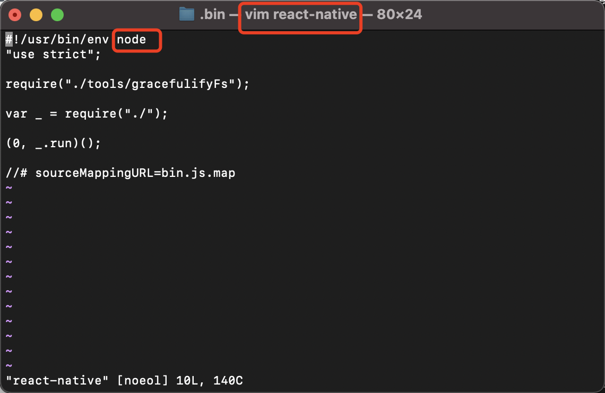

## 开始入门

### 1、官网走一个
+ [React Native中文网](https://www.react-native.cn)
+ [React Native](https://reactnative.dev)
  
<br/>
<br/>

### 2、搭建环境

&ensp;&ensp;自然就是根据官网的搭建环境说明操作起来，


### 3、demo走起来


### 4、分析下
&ensp;&ensp;首先看下React Native的源码组成，可以清晰地看出就是为了适配Android、IOS而做了大量的工作。

<br/>


<br/>

&ensp;&ensp;看了说明，就是一个使用React来构建原生应用的框架。那我们再来看React源码组成。可以看到几乎都是JavaScript，同时还有其他前端语言，但是还有C++，这个C++是用于运行时，还是编译时，值得研究一下。

<br/>


<br/>

&ensp;&ensp;到这里就很清晰了，react是个javaScript库。
+ 需要node，原因是react-native是一个node应用，需要node.js运行时环境，而且我们本机操作系统也需要通过npm包管理器把包工具下载下来。
+ 需要Watchman，Watchman则是由 Facebook 提供的监视文件系统变更的工具。安装此工具可以提高开发时的性能（packager 可以快速捕捉文件的变化从而实现实时刷新）。
+ Android应用需要JDK和Android Studio。具体的原因，因为这个是必须的。
+ ios应用需要Xcode 和 CocoaPods。具体的原因，因为这个是必须的。

<br/>

&ensp;&ensp;`npx react-native init AwesomeProject`命令创建一个新的React Native应用。对于集成到现有原生应用，这个需要后续研究操作一下。我们看到编译并运行 React Native 应用的命令是下面这个
``` bash
cd AwesomeProject
yarn android
# 或者
yarn react-native run-android
```

<br/>

&ensp;&ensp;看到这里有个yarn命令,我们通过`type yarn`命令找到yarn命令执行文件，然后通过`vim yarn`命令查看执行文件的源码，一看，这不和npm一样的嘛，可以简单理解为都是node应用。这再次折射出node真的博大精深，发展快速啊。

<br/>


<br/>


<br/>

&ensp;&ensp;这样一看源码的编程语言结构，几乎是JavaScript，这个和npm很像。那到这里我们猜测下：
+ nvm这类bash应用，由于是shell命令，都是Unix平台相关的。
+ npm、yarn这类node工具应用，都是和平台无关的。
+ node这类C++应用,都是和平台相关的。
+ react-native和react这类都是框架。相应都是有node应用工具链的，例如
 
  + react-native:react-native
  + react:create-react-app
+ 因此，对于工具应用、库、框架的关系就得好好分辨清楚。

<br/>



<br/>


<br/>

&ensp;&ensp;看到react-native的demo，实际上就是通过工具来生成demo代码，代码中使用到框架与库的代码，在编译执行时，这里就有一堆编译工具链，最终生成我们需要的产物。因此，学习React-Native这种开发思想就更加重要，毕竟轮子时时变，怎么造的就更为关键。

<br/>


<br/>


<br/>

### 5、后续计划

&ensp;&ensp;后续熟悉文档，阅读demo源码，进一步阅读底层源码实现。

### 备忘录
+ 当自己在写一个框架给别人用的时候，除了代码优雅好用之外，说明文档是否能做到快速了解，快速上手，这个挺重要的。
+ React Native应用。集成到现有原生应用。
+ 